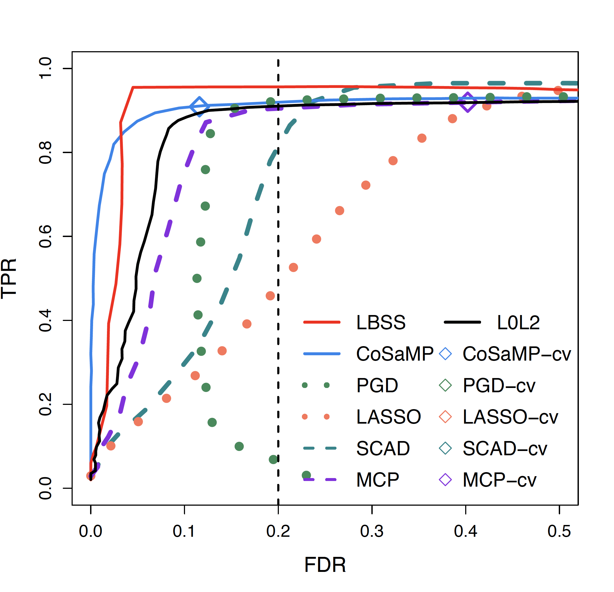

# Solution Paths

Some sample codes to compute and compare the solution paths in R. 

**Competitors**: LASSO, SCAD, MCP and L0 methods (best subset selection, one/two stage IHT).

**Files**:
- 'functions.R': collects functions to generate the paths given X, Y and other inputs
- 'path12.R': generates the solution paths of LASSO, SCAD, MCP, two-stage IHT based on Monte Carlo repetitions
- 'path_LBSS.R': generates the solution paths of LBSS (LASSO + best subset selection) based on Monte Carlo repetitions
- 'path_iht.R': generates the solution paths of one-stage IHT based on Monte Carlo repetitions

**A sample path plot**:

**Reference**:
[On sure early selection of the best subset](https://arxiv.org/abs/2107.06939)
